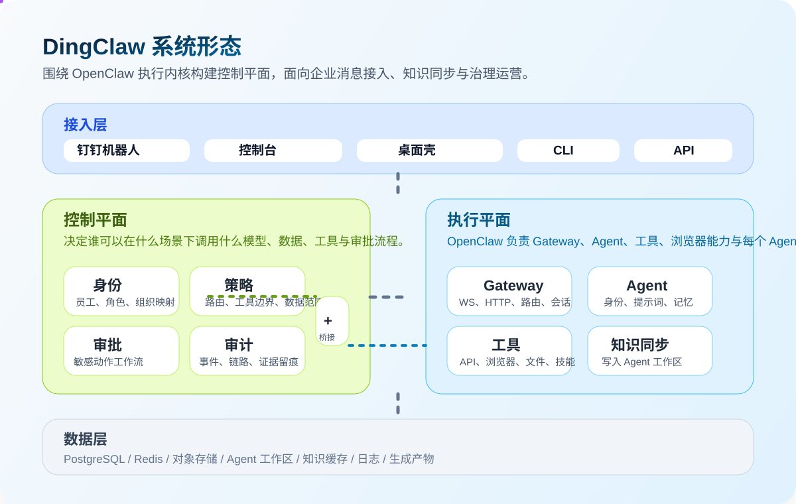
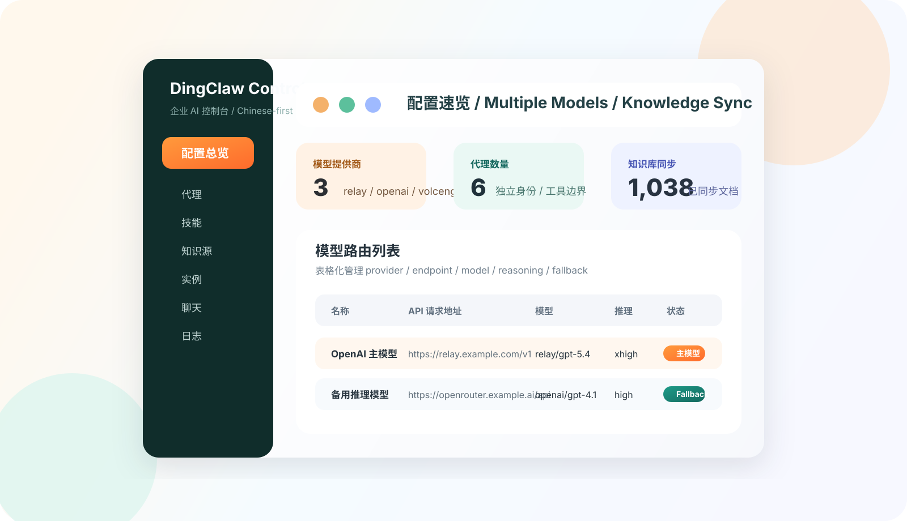
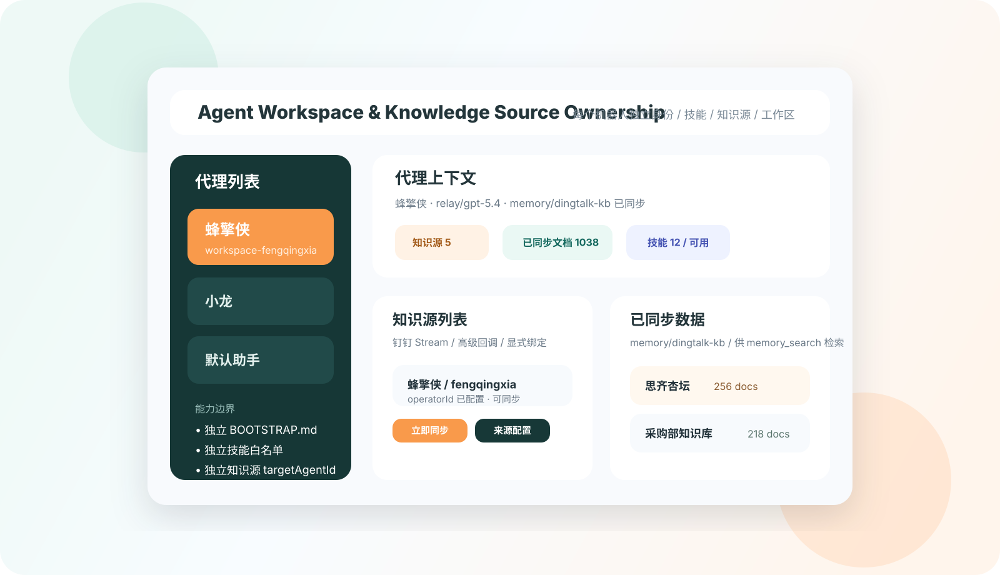
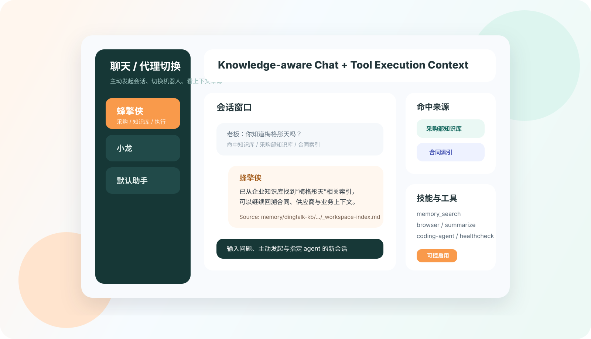

# DingClaw

<p align="center">
  
</p>

<p align="center">
  
  
  
  
  
  
</p>

<p align="center">
  <strong>把 OpenClaw 变成真正可运营、可隔离、可治理的钉钉企业 AI 网关。</strong>
</p>

<p align="center">
  简体中文 | <a href="./README_EN.md">English</a> | <a href="./README_KO.md">한국어</a>
</p>

<p align="center">
  <a href="#为什么是-dingclaw">Why</a> ·
  <a href="#核心能力">Capabilities</a> ·
  <a href="#一图看懂架构">Architecture</a> ·
  <a href="#快速开始">Quick Start</a> ·
  <a href="#安装与发布">Install & Release</a> ·
  <a href="#star-history">Star History</a>
</p>

> `DingClaw` 不是“再做一个聊天机器人”，而是把 AI 助手真正接进钉钉工作流、组织身份、知识同步、模型治理、工具审批和审计闭环。

## 为什么是 DingClaw

普通“企业机器人”常见的问题是：

- 只能收消息，不能稳定识别“是谁、在哪个群、该用什么身份回答”
- 多个机器人共用一个 main，工作区、人格、知识和会话容易串线
- 知识库、审批、浏览器执行、内部 API 各自割裂，难以闭环
- 出问题后无法追溯“谁触发了什么动作，用了哪个模型，命中了哪些数据”
- 上游升级后私改越来越重，维护成本越来越高

`DingClaw` 的目标很明确：

- `Identity First`：先识别身份和场景，再决定路由、人格和权限
- `Policy First`：模型、工具、审批、数据范围全部走规则
- `Agent Isolation`：每个 Agent 独立工作区、独立身份、独立技能边界、独立知识缓存
- `Chinese Operator UX`：控制台优先中文，配置和状态可见化，不靠猜
- `Upgradeable Fork`：尽量少改 OpenClaw 核心，把企业能力收敛到扩展层和外围服务

## 三语定位

| 语言    | 简介                                                                                                                                                                     |
| ------- | ------------------------------------------------------------------------------------------------------------------------------------------------------------------------ |
| 中文    | DingClaw 是一个面向企业自托管场景的 OpenClaw 增强版，重点解决钉钉接入、多 Agent 隔离、知识库同步、模型路由、审批治理和中文运维台。                                       |
| English | DingClaw is an enterprise-focused OpenClaw fork for DingTalk-native operations, multi-agent isolation, knowledge sync, model routing, and governance-ready self-hosting. |
| 한국어  | DingClaw 는 DingTalk 연동, 독립 Agent 작업공간, 지식 동기화, 모델 라우팅, 승인 및 감사 운영을 강화한 엔터프라이즈용 OpenClaw 포크입니다.                                 |

## 核心能力

<table>
  <tr>
    <td width="33%" valign="top">
      <strong>DingTalk Native</strong><br />
      多账号钉钉机器人接入、群聊和私聊隔离、知识库同步，贴合国内企业使用场景。
    </td>
    <td width="33%" valign="top">
      <strong>Agent Isolation</strong><br />
      每个 Agent 独立工作区、独立身份、独立技能白名单、独立知识源归属。
    </td>
    <td width="33%" valign="top">
      <strong>Model Routing</strong><br />
      支持多提供商、多模型、主模型、fallback、推理强度和工具白名单。
    </td>
  </tr>
  <tr>
    <td width="33%" valign="top">
      <strong>Knowledge Sync</strong><br />
      钉钉知识库可同步到指定 Agent 工作区，直接为检索、记忆和回答服务。
    </td>
    <td width="33%" valign="top">
      <strong>Governance First</strong><br />
      审批、审计、权限、策略和身份映射优先，不把企业风控留给提示词临时处理。
    </td>
    <td width="33%" valign="top">
      <strong>Release Ready</strong><br />
      已补齐 npm 安装、CLI 安装脚本、GitHub Releases 资产打包和 fork 发布链路。
    </td>
  </tr>
</table>

## 一图看懂架构

<p align="center">
  
</p>

这套架构可以简单理解为两层：

- 控制平面：负责身份、策略、审批、审计、模型注册和中文管理台
- 执行平面：负责 OpenClaw Gateway、Agent Runtime、工具执行、浏览器能力、知识同步和工作区

换句话说，OpenClaw 解决“怎么跑”，DingClaw 解决“谁能跑、跑什么、是否需要审批、如何审计和隔离”。

## 控制台预览

<p align="center">
  
</p>

<table>
  <tr>
    <td width="50%" valign="top">
      
      <strong>Agent 独立工作区</strong><br />
      每个机器人都有自己的身份、技能、知识源归属和工作区，不再共享一个 main。
    </td>
    <td width="50%" valign="top">
      
      <strong>知识感知聊天</strong><br />
      聊天时可以明确看到当前 agent、命中的知识源和可用工具，更适合企业内部问答与执行。
    </td>
  </tr>
</table>

## 当前已经落地的内容

- [x] 中文控制台，包含配置、代理、技能、知识源、实例、聊天、日志等页面
- [x] `/config` 根页配置速览、分区入口和模型关系概览
- [x] 多 Agent 独立工作区与独立 `BOOTSTRAP.md`
- [x] 多模型配置能力，支持主模型、白名单、推理强度和 fallback 路由
- [x] 钉钉知识库同步到指定 Agent 工作区的 `memory/dingtalk-kb`
- [x] 代理上下文视图，可查看知识源归属和同步结果
- [x] 桌面壳 `desktop-shell`，可启动或附着本地 Gateway
- [x] npm 安装、CLI 安装脚本、GitHub Release 自动发布流程
- [x] 本地开发时优先覆盖 Gateway 自动拉起的控制台静态资源

## 推荐部署方式

在企业接入里，推荐把“Agent”和“机器人实例 / 渠道账号”看成 `1:1` 关系来设计：

- 一个 Agent 只绑定一个实例
- 一个实例只服务一个 Agent
- 不同机器人不要共用同一个 Agent 的工作区、身份、技能白名单和知识缓存

这样做的收益很直接：

- 身份不会串线，不会出现 A 机器人自称成 B
- `BOOTSTRAP.md`、身份设定、技能和知识源归属都更稳定
- 排查问题时可以明确知道“哪个实例对应哪个 Agent”
- 后续接飞书、Telegram、Slack 等多渠道时，路由关系也更清晰

如果你是故意让多个实例共用同一个 Agent，那么这不再是默认推荐模式，至少还要补一层私聊隔离：

```yaml
session:
  dmScope: per-account-channel-peer
```

补充说明：

- 群聊 / 频道会话本身已经按 `agentId + channel + accountId + peerId` 做隔离
- 私聊如果不把 `session.dmScope` 调成 `per-account-channel-peer`，多个实例仍可能共用同一个主会话
- 所以本项目的默认运维建议是：`单个 Agent = 单个实例`

## 快速开始

推荐环境：

- Node `22.16+`
- `pnpm 10.x`

<table>
  <tr>
    <th align="left">步骤</th>
    <th align="left">命令 / 动作</th>
    <th align="left">说明</th>
  </tr>
  <tr>
    <td>1. 安装依赖</td>
    <td><code>pnpm install</code></td>
    <td>拉起 monorepo 依赖</td>
  </tr>
  <tr>
    <td>2. 构建控制台</td>
    <td><code>pnpm ui:build</code></td>
    <td>生成当前仓库的控制台静态资源</td>
  </tr>
  <tr>
    <td>3. 启动 Gateway</td>
    <td><code>pnpm openclaw gateway --port 18789 --verbose</code></td>
    <td>本地启动主运行时</td>
  </tr>
  <tr>
    <td>4. 打开控制台</td>
    <td><code>http://127.0.0.1:18789/</code></td>
    <td>进入 Web 管理台</td>
  </tr>
  <tr>
    <td>5. 启动桌面壳</td>
    <td><code>pnpm desktop:dev</code></td>
    <td>本地桌面附着 / 拉起 Gateway</td>
  </tr>
</table>

当前仓库还包含一个实用改动：当 Gateway 通过本地开发脚本自动拉起时，会优先使用当前仓库里构建出来的 `dist/control-ui`，不再优先吃旧的包内静态资源；`ui/**` 发生改动时，也会自动触发 `ui:build`。

## 安装与发布

### CLI / npm 安装

全局安装发布包：

```bash
npm install -g openclaw-dingtalk
```

安装后可使用两个命令入口：

- `openclaw`
- `dingclaw`

一键安装脚本：

```bash
curl -fsSL https://raw.githubusercontent.com/yansheng21/openclaw-dingtalk/main/scripts/install.sh | bash
```

仅安装 CLI：

```bash
curl -fsSL https://raw.githubusercontent.com/yansheng21/openclaw-dingtalk/main/scripts/install-cli.sh | bash
```

### Releases

当前仓库已经补齐了一条面向 fork 的发布链路：

- npm 包名：`openclaw-dingtalk`
- GitHub 仓库：`https://github.com/yansheng21/openclaw-dingtalk`
- 推荐标签：`vYYYY.M.D` 或 `vYYYY.M.D-beta.N`

发布后会自动生成 GitHub Release，并附带这些资产：

- `npm pack` 生成的 tarball
- `install.sh`
- `install-cli.sh`
- `install.ps1`
- `SHA256SUMS.txt`

如果要真正发布到 npm，还需要在对应 package 上开启 trusted publishing，并把 GitHub 仓库绑定到 `openclaw-dingtalk`。

## 仓库地图

<details>
  <summary><strong>点击展开仓库结构</strong></summary>

```text
apps/
  admin-console/         管理端表面
  control-api/           控制面 API
  runtime-api/           运行时桥接 API
  desktop-shell/         Electron 桌面壳
  jobs/                  异步任务和同步作业

packages/
  shared-types/          共享类型
  shared-config/         配置读取与校验
  database/              数据访问层
  identity-service/      身份映射与画像
  policy-engine/         权限策略引擎
  approval-service/      审批流
  audit-service/         审计与证据
  runtime-bridge/        与 OpenClaw Runtime 的桥接
  model-registry/        模型和中转配置

extensions/
  dingtalk-enterprise/   钉钉企业扩展
  dingtalk-connector/    钉钉接入与知识同步

ui/
  src/                   控制台前端

src/
  gateway/               OpenClaw Gateway 及服务端方法
  infra/                 运行时基础设施
```

</details>

## 蓝图与后续方向

仓库里已经放了完整的企业化蓝图，建议优先看这三份：

- `docs/blueprint/01-product-overview.md`
- `docs/blueprint/02-system-architecture.md`
- `docs/blueprint/12-mvp-build-slices.md`

其他蓝图还包括：

- 产品总览、系统架构、身份与策略
- 数据模型、包边界、API 边界
- 管理台信息架构、数据库 ERD
- MVP 切片、风险登记和路线图

## 远端策略

- `upstream`: `https://github.com/openclaw/openclaw.git`
- `target`: `https://github.com/yansheng21/openclaw-dingtalk.git`
- `origin`: 你的日常开发仓库

这种结构的目标很直接：既保留对上游 OpenClaw 的跟进能力，也把企业化演进沉淀到自己的 fork 和发布链路里。

## Star History

<p align="center">
  <a href="https://star-history.com/#yansheng21/openclaw-dingtalk&amp;Date">
    
  </a>
</p>
