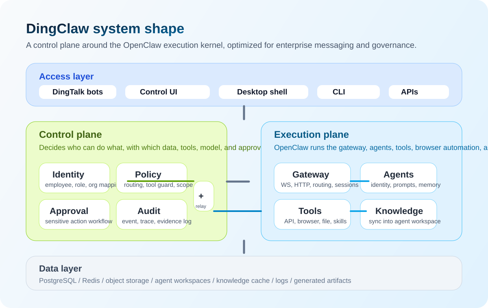

# DingClaw

<p align="center">
  
</p>

<p align="center">
  
  
  
  
  
  
</p>

<p align="center">
  <strong>DingTalk-first enterprise AI gateway built on top of OpenClaw.</strong>
</p>

<p align="center">
  简体中文 | <a href="./README_EN.md">English</a> | <a href="./README_JA.md">日本語</a> | <a href="./README_KO.md">한국어</a>
</p>

<p align="center">
  <a href="#快速开始">Quick Start</a> ·
  <a href="#cli--npm-安装">Install</a> ·
  <a href="#发布与-releases">Releases</a> ·
  <a href="#一图看懂">Architecture</a> ·
  <a href="#star-history">Star History</a>
</p>

`DingClaw` 是一个面向企业场景的 OpenClaw 增强版，重点不是“再做一个聊天机器人”，而是把 AI 助手真正接进钉钉工作流、组织身份、权限策略、审批治理、知识同步和工具执行闭环。

它保留 OpenClaw 作为执行内核，同时补上企业真正需要的控制平面能力：

- 多账号钉钉接入与会话隔离
- 多 Agent 独立工作区、独立身份、独立技能边界
- 中文管理控制台
- 多模型配置、模型路由与 fallback
- 钉钉知识库同步到 Agent 工作区
- 工具调用审批、留痕与审计
- 面向自托管部署的 npm 安装和 GitHub Releases 发布链路

## 多语言介绍

| 语言    | 简介                                                                                                                                                                        |
| ------- | --------------------------------------------------------------------------------------------------------------------------------------------------------------------------- |
| 中文    | DingClaw 是一个面向企业自托管场景的 OpenClaw 增强版，重点解决钉钉接入、多 Agent 隔离、知识库同步、模型路由、审批治理和中文运维台。                                          |
| English | DingClaw is an enterprise-focused OpenClaw fork for DingTalk-native AI operations, multi-agent isolation, knowledge sync, model routing, and governance-ready self-hosting. |
| 日本語  | DingClaw は、DingTalk 連携、マルチエージェント分離、ナレッジ同期、モデルルーティング、監査運用を強化した OpenClaw のエンタープライズ向け拡張版です。                        |
| 한국어  | DingClaw 는 DingTalk 연동, 독립 Agent 작업공간, 지식 동기화, 모델 라우팅, 거버넌스 중심 운영을 강화한 엔터프라이즈용 OpenClaw 포크입니다.                                   |

## 核心亮点

| 能力                | 说明                                                                       |
| ------------------- | -------------------------------------------------------------------------- |
| DingTalk Native     | 多账号机器人接入、群聊与私聊隔离、知识库同步、企业工作流贴合国内使用场景。 |
| Agent Isolation     | 每个 Agent 独立工作区、独立 BOOTSTRAP/身份、独立技能边界、独立知识源归属。 |
| Model Routing       | 支持多提供商、多模型、默认主模型、fallback 路由、推理强度和工具白名单。    |
| Governance First    | 审批、审计、权限、策略和身份映射优先，不把企业风险控制留给提示词临时处理。 |
| Chinese Operator UX | 控制台优先中文，围绕配置、代理、技能、知识源和聊天管理做可见化设计。       |
| Release Ready       | 已补齐 npm 安装、CLI 安装脚本、GitHub Releases 资产打包和 fork 发布链路。  |

## 为什么是 DingClaw

普通“企业机器人”常见的问题是：

- 只能收消息，不能识别“是谁、在哪个群、用什么身份在说话”
- 只能接一个模型，无法治理模型、工具和风险边界
- 知识库、审批、内部 API、浏览器执行各自割裂
- 出问题之后无法还原“谁让机器人做了什么”
- 一旦上游升级，私改内核会越来越难维护

`DingClaw` 的目标是把这些问题系统化收口：

- `Identity First`：先识别身份和场景，再决定路由、人格和权限
- `Policy First`：工具、数据范围、审批、Agent 选择全部走规则
- `Chinese Operator Experience`：后台、配置、状态、知识同步界面默认中文
- `Minimal Core Patch`：尽量少改 OpenClaw 核心，把企业能力收敛到扩展层和外围服务

## 一图看懂

<p align="center">
  
</p>

这套架构可以简单理解为两层：

- 控制平面：负责身份、策略、审批、审计、模型注册和管理台
- 执行平面：负责 OpenClaw Gateway、Agent Runtime、工具执行、知识同步和工作区

换句话说，OpenClaw 解决“怎么跑”，DingClaw 解决“谁能跑、跑什么、要不要审批、怎么审计”。

## 产品界面

<p align="center">
  
</p>

<table>
  <tr>
    <td width="50%" valign="top">
      
      <strong>Agent 独立工作区</strong><br />
      每个机器人都有自己的身份、技能、知识源归属和工作区，不再共享一个 main。
    </td>
    <td width="50%" valign="top">
      
      <strong>知识感知聊天</strong><br />
      聊天时可以明确看到当前 agent、命中的知识源和可用工具，更适合企业内部问答与执行。
    </td>
  </tr>
</table>

## 当前仓库已经具备什么

这不是一份空蓝图仓库。当前代码已经包含一批可以直接落地的企业化改动：

- 中文控制台，包含配置、代理、技能、知识源、实例、聊天、日志等页面
- `/config` 根页的配置概览入口和模型关系概览
- 多 Agent 独立工作区与独立 `BOOTSTRAP.md`
- 多模型配置能力，支持主模型、白名单、推理强度和 fallback 路由
- 钉钉知识库同步到指定 Agent 工作区的 `memory/dingtalk-kb`
- 代理上下文视图，可查看知识源归属和同步结果
- 桌面壳 `desktop-shell`，可启动或附着本地 Gateway
- npm 安装、CLI 安装脚本、GitHub Release 自动发布流程

## 运行形态

仓库中的几个关键表面如下：

| 表面                  | 作用                                                                       |
| --------------------- | -------------------------------------------------------------------------- |
| `Gateway`             | 唯一长驻运行时，负责 WebSocket、HTTP、消息接入、Agent 调用、控制台静态资源 |
| `Control UI`          | Web 管理台，中文优先，负责配置、状态、代理、技能、知识源管理               |
| `Desktop Shell`       | Electron 壳，负责本地启动 / 附着 Gateway，并快速打开管理端                 |
| `Agents`              | 每个 Agent 都可以拥有独立工作区、身份、技能、知识缓存                      |
| `DingTalk Connectors` | 多账号钉钉机器人接入、知识库同步、消息收发与会话隔离                       |
| `Enterprise Services` | 身份、策略、审批、审计、模型注册等企业能力                                 |

## 仓库结构

```text
apps/
  admin-console/         管理端表面
  control-api/           控制面 API
  runtime-api/           运行时桥接 API
  desktop-shell/         Electron 桌面壳
  jobs/                  异步任务和同步作业

packages/
  shared-types/          共享类型
  shared-config/         配置读取与校验
  database/              数据访问层
  identity-service/      身份映射与画像
  policy-engine/         权限策略引擎
  approval-service/      审批流
  audit-service/         审计与证据
  runtime-bridge/        与 OpenClaw Runtime 的桥接
  model-registry/        模型和中转配置

extensions/
  dingtalk-enterprise/   钉钉企业扩展
  dingtalk-connector/    钉钉接入与知识同步

ui/
  src/                   控制台前端

src/
  gateway/               OpenClaw Gateway 及服务端方法
  infra/                 运行时基础设施
```

## 快速开始

推荐环境：

- Node `22.16+`
- `pnpm 10.x`

安装依赖：

```bash
pnpm install
```

本地开发构建控制台：

```bash
pnpm ui:build
```

启动 Gateway：

```bash
pnpm openclaw gateway --port 18789 --verbose
```

打开控制台：

```text
http://127.0.0.1:18789/
```

启动桌面壳：

```bash
pnpm desktop:dev
```

当前仓库已经补了一个实用改动：当 Gateway 通过本地开发脚本自动拉起时，会优先使用当前仓库里构建出来的 `dist/control-ui`，不再优先吃旧的包内静态资源；`ui/**` 发生改动时，也会自动触发 `ui:build`。

## CLI / npm 安装

全局安装发布包：

```bash
npm install -g openclaw-dingtalk
```

安装后可使用两个命令入口：

- `openclaw`
- `dingclaw`

一键安装脚本：

```bash
curl -fsSL https://raw.githubusercontent.com/yansheng21/openclaw-dingtalk/main/scripts/install.sh | bash
```

仅安装 CLI：

```bash
curl -fsSL https://raw.githubusercontent.com/yansheng21/openclaw-dingtalk/main/scripts/install-cli.sh | bash
```

## 发布与 Releases

当前仓库已经补齐了一条面向 fork 的发布链路：

- npm 包名：`openclaw-dingtalk`
- GitHub 仓库：`https://github.com/yansheng21/openclaw-dingtalk`
- 推荐标签：`vYYYY.M.D` 或 `vYYYY.M.D-beta.N`

发布后会自动生成 GitHub Release，并附带这些资产：

- `npm pack` 生成的 tarball
- `install.sh`
- `install-cli.sh`
- `install.ps1`
- `SHA256SUMS.txt`

如果要真正发布到 npm，还需要在对应 package 上开启 trusted publishing，并把 GitHub 仓库绑定到 `openclaw-dingtalk`。

## 设计原则

- `API First`：能走正式 API 的流程不走浏览器自动化
- `Identity First`：先确认说话人，再决定路由和回答边界
- `Policy First`：工具、模型、审批、数据范围都通过策略决定
- `Secure by Default`：默认白名单、默认审计、默认可控
- `Upgradeable Fork`：保留 `upstream`，尽量降低长期跟随 OpenClaw 升级的成本

## 蓝图与后续方向

仓库里已经放了完整的企业化蓝图，建议优先看这三份：

- `docs/blueprint/01-product-overview.md`
- `docs/blueprint/02-system-architecture.md`
- `docs/blueprint/12-mvp-build-slices.md`

其他蓝图还包括：

- 产品总览、系统架构、身份与策略
- 数据模型、包边界、API 边界
- 管理台信息架构、数据库 ERD
- MVP 切片、风险登记和路线图

## 远端策略

- `upstream`: `https://github.com/openclaw/openclaw.git`
- `target`: `https://github.com/yansheng21/openclaw-dingtalk.git`
- `origin`: 你的日常开发仓库

这种结构的目标很直接：既保留对上游 OpenClaw 的跟进能力，也把企业化演进沉淀到自己的 fork 和发布链路里。

## Star History

<p align="center">
  <a href="https://star-history.com/#yansheng21/openclaw-dingtalk&amp;Date">
    
  </a>
</p>
