# DingClaw

<p align="center">
  
</p>

<p align="center">
  
  
  
  
</p>

<p align="center">
  <a href="./README.md">简体中文</a> | English | <a href="./README_JA.md">日本語</a> | <a href="./README_KO.md">한국어</a>
</p>

`DingClaw` is an enterprise-focused OpenClaw fork built for DingTalk-native operations. It adds multi-account DingTalk connectivity, isolated agents and workspaces, model routing with fallback, knowledge sync, auditability, and a Chinese-first control console for self-hosted deployments.

## Highlights

- DingTalk-first multi-bot access with account isolation
- Per-agent workspaces, BOOTSTRAP identity, and skill boundaries
- Multi-model routing with primary, fallback, reasoning, and tool allowlists
- DingTalk knowledge base sync into agent-local memory stores
- Governance-oriented operations with policy, approval, and audit support
- npm installation, CLI install scripts, and GitHub Releases packaging

## Quick Start

```bash
pnpm install
pnpm ui:build
pnpm openclaw gateway --port 18789 --verbose
```

Open `http://127.0.0.1:18789/` to access the control UI.

## Project Surfaces

| Surface             | Purpose                                                                             |
| ------------------- | ----------------------------------------------------------------------------------- |
| Gateway             | Long-running runtime for WebSocket, HTTP, channel ingress, agents, and static UI    |
| Control UI          | Chinese-first admin console for config, agents, skills, knowledge sources, and chat |
| Desktop Shell       | Electron shell that starts or attaches to the local gateway                         |
| Agents              | Isolated workspaces, personas, skills, and knowledge caches                         |
| DingTalk Connectors | Multi-account messaging and knowledge synchronization                               |

## Links

- Main README: [`README.md`](./README.md)
- Blueprint overview: [`docs/blueprint/01-product-overview.md`](./docs/blueprint/01-product-overview.md)
- System architecture: [`docs/blueprint/02-system-architecture.md`](./docs/blueprint/02-system-architecture.md)
- MVP slices: [`docs/blueprint/12-mvp-build-slices.md`](./docs/blueprint/12-mvp-build-slices.md)
