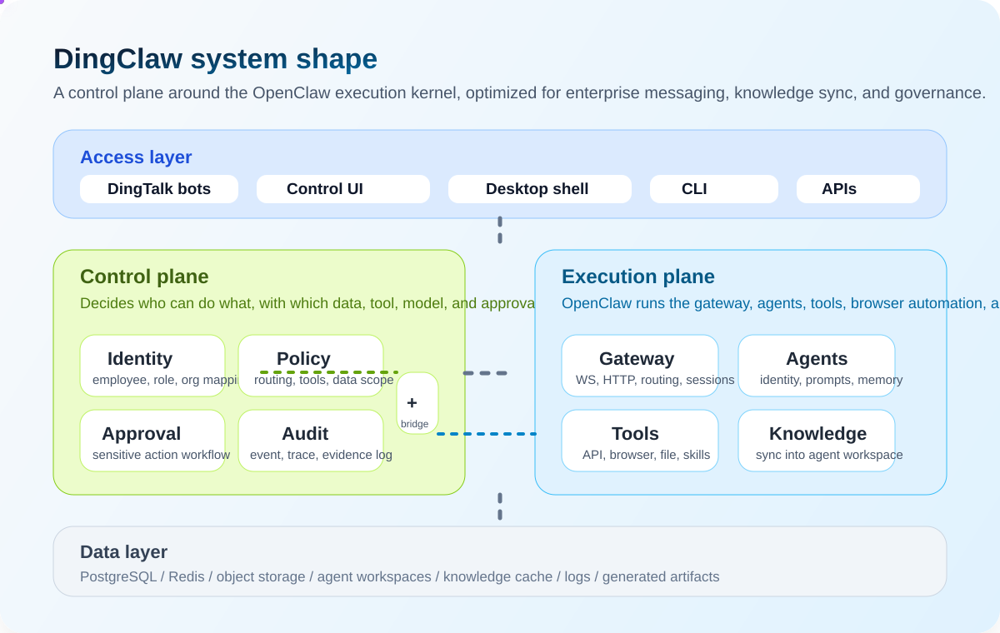

# DingClaw

<p align="center">
  
</p>

<p align="center">
  
  
  
  
  
</p>

<p align="center">
  <strong>DingTalk-first enterprise AI gateway built on top of OpenClaw.</strong>
</p>

<p align="center">
  <a href="./README.md">简体中文</a> | English | <a href="./README_KO.md">한국어</a>
</p>

<p align="center">
  <a href="#why-dingclaw">Why</a> ·
  <a href="#capabilities">Capabilities</a> ·
  <a href="#architecture">Architecture</a> ·
  <a href="#quick-start">Quick Start</a> ·
  <a href="#install--release">Install & Release</a> ·
  <a href="#star-history">Star History</a>
</p>

> `DingClaw` is not another chat wrapper. It turns OpenClaw into a governable enterprise gateway for DingTalk workflows, multi-agent isolation, knowledge sync, model routing, approvals, and audits.

## Why DingClaw

Typical “enterprise bots” break down in predictable ways:

- They receive messages, but do not reliably understand who is speaking, in which context, and under which assistant identity
- Multiple bots often share one main workspace, one persona, and one memory cache
- Knowledge, approvals, browser automation, and internal APIs remain disconnected
- Operators cannot answer basic questions like who triggered what, with which model, and against which data scope
- Heavy core patching becomes harder to maintain as upstream evolves

`DingClaw` addresses that by prioritizing:

- `Identity First`: resolve speaker and scene before routing, persona, and permissions
- `Policy First`: models, tools, approvals, and data scope are rule-driven
- `Agent Isolation`: each agent has its own workspace, identity, skill boundary, and knowledge ownership
- `Operator UX`: Chinese-first control UI with visible config and runtime state
- `Upgradeable Fork`: keep enterprise features around the core instead of burying them inside it

## Capabilities

<table>
  <tr>
    <td width="33%" valign="top">
      <strong>DingTalk Native</strong><br />
      Multi-account DingTalk bot access, DM and group isolation, and knowledge-base sync for real enterprise traffic.
    </td>
    <td width="33%" valign="top">
      <strong>Agent Isolation</strong><br />
      Per-agent workspaces, personas, skill allowlists, and knowledge ownership instead of one shared main agent.
    </td>
    <td width="33%" valign="top">
      <strong>Model Routing</strong><br />
      Multiple providers, multiple models, primary route, fallback chain, reasoning controls, and tool allowlists.
    </td>
  </tr>
  <tr>
    <td width="33%" valign="top">
      <strong>Knowledge Sync</strong><br />
      DingTalk knowledge bases can sync directly into the target agent workspace for retrieval and memory tools.
    </td>
    <td width="33%" valign="top">
      <strong>Governance First</strong><br />
      Approval, audit, identity mapping, and policy enforcement are first-class runtime concerns.
    </td>
    <td width="33%" valign="top">
      <strong>Release Ready</strong><br />
      npm installation, CLI install scripts, and GitHub Releases packaging are already wired for this fork.
    </td>
  </tr>
</table>

## Architecture

<p align="center">
  
</p>

At a high level:

- The control plane decides who can do what, with which model, data scope, tool, and approval flow
- The execution plane runs the OpenClaw gateway, agents, tools, browser automation, and per-agent workspaces

OpenClaw handles runtime execution. DingClaw adds identity, routing, governance, and operator-facing controls around it.

## UI Preview

<p align="center">
  
</p>

<table>
  <tr>
    <td width="50%" valign="top">
      
      <strong>Isolated agent workspaces</strong><br />
      Each bot can keep its own persona, skills, knowledge sources, and workspace.
    </td>
    <td width="50%" valign="top">
      
      <strong>Knowledge-aware chat</strong><br />
      Operators can see the current agent, matched knowledge source, and tool availability while chatting.
    </td>
  </tr>
</table>

## What Already Ships

- Chinese control UI for config, agents, skills, knowledge, instances, chat, and logs
- `/config` overview entry with model routing visibility
- Multi-agent isolated workspaces with dedicated `BOOTSTRAP.md`
- Multi-model routing with primary model, fallback, reasoning, and tool allowlists
- DingTalk knowledge sync into `memory/dingtalk-kb` inside the target agent workspace
- Agent context panel for source ownership and sync results
- Desktop shell that starts or attaches to the local gateway
- npm packaging, install scripts, and GitHub Release artifacts

## Recommended Deployment Pattern

For enterprise deployments, treat “agent” and “bot instance / channel account” as a `1:1` relationship:

- One agent should bind to one instance
- One instance should serve one agent
- Do not let multiple bots share the same workspace, persona, skill boundary, or knowledge cache unless that is intentional

This avoids identity bleed, workspace confusion, and support ambiguity.

If you intentionally let multiple instances reuse the same agent, you should also isolate DM sessions per account:

```yaml
session:
  dmScope: per-account-channel-peer
```

## Quick Start

Recommended environment:

- Node `22.16+`
- `pnpm 10.x`

```bash
pnpm install
pnpm ui:build
pnpm openclaw gateway --port 18789 --verbose
```

Open `http://127.0.0.1:18789/` to access the control UI.

Start the desktop shell with:

```bash
pnpm desktop:dev
```

## Install & Release

Install the published package globally:

```bash
npm install -g openclaw-dingtalk
```

You can then use either command:

- `openclaw`
- `dingclaw`

Install scripts:

```bash
curl -fsSL https://raw.githubusercontent.com/yansheng21/openclaw-dingtalk/main/scripts/install.sh | bash
curl -fsSL https://raw.githubusercontent.com/yansheng21/openclaw-dingtalk/main/scripts/install-cli.sh | bash
```

Release notes:

- npm package: `openclaw-dingtalk`
- GitHub repo: `https://github.com/yansheng21/openclaw-dingtalk`
- Recommended tags: `vYYYY.M.D` or `vYYYY.M.D-beta.N`

## Links

- Main README: [`README.md`](./README.md)
- Product overview: [`docs/blueprint/01-product-overview.md`](./docs/blueprint/01-product-overview.md)
- System architecture: [`docs/blueprint/02-system-architecture.md`](./docs/blueprint/02-system-architecture.md)
- MVP slices: [`docs/blueprint/12-mvp-build-slices.md`](./docs/blueprint/12-mvp-build-slices.md)

## Star History

<p align="center">
  <a href="https://star-history.com/#yansheng21/openclaw-dingtalk&amp;Date">
    
  </a>
</p>
