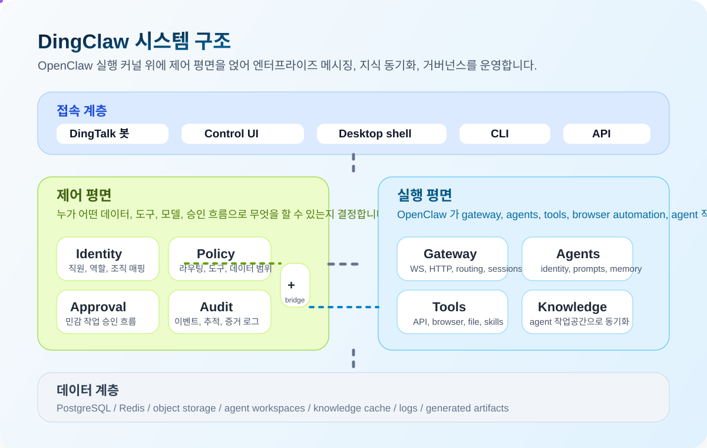

# DingClaw

<p align="center">
  
</p>

<p align="center">
  
  
  
  
  
</p>

<p align="center">
  <strong>OpenClaw 위에 구축된 DingTalk 중심 엔터프라이즈 AI 게이트웨이.</strong>
</p>

<p align="center">
  <a href="./README.md">简体中文</a> | <a href="./README_EN.md">English</a> | 한국어
</p>

<p align="center">
  <a href="#왜-dingclaw인가">Why</a> ·
  <a href="#핵심-기능">Capabilities</a> ·
  <a href="#아키텍처">Architecture</a> ·
  <a href="#빠른-시작">Quick Start</a> ·
  <a href="#설치--릴리스">Install & Release</a> ·
  <a href="#star-history">Star History</a>
</p>

> `DingClaw` 는 단순한 채팅 래퍼가 아닙니다. OpenClaw 를 DingTalk 업무 흐름, 에이전트 격리, 지식 동기화, 모델 라우팅, 승인, 감사까지 다루는 엔터프라이즈 운영 게이트웨이로 확장합니다.

## 왜 DingClaw인가

일반적인 “엔터프라이즈 봇”은 보통 다음 문제를 겪습니다.

- 누가 말하는지, 어떤 대화 맥락인지, 어떤 봇 정체성으로 답해야 하는지 안정적으로 구분하지 못함
- 여러 봇이 하나의 main 작업공간과 기억을 공유해서 정체성과 맥락이 섞임
- 지식베이스, 승인, 브라우저 자동화, 내부 API 가 서로 분리되어 있음
- 누가 무엇을 트리거했고 어떤 모델과 데이터 범위를 썼는지 추적하기 어려움
- 업스트림 업데이트가 진행될수록 포크 유지가 무거워짐

`DingClaw` 는 이를 다음 원칙으로 정리합니다.

- `Identity First`: 화자와 장면을 먼저 확인한 뒤 라우팅, 페르소나, 권한을 결정
- `Policy First`: 모델, 도구, 승인, 데이터 범위를 규칙 기반으로 통제
- `Agent Isolation`: 각 agent 가 독립 작업공간, 정체성, 스킬 경계, 지식 소유권을 가짐
- `Operator UX`: 중국어 우선 관리 UI 로 설정과 상태를 눈에 보이게 운영
- `Upgradeable Fork`: 핵심을 과도하게 건드리지 않고 엔터프라이즈 기능을 바깥 레이어에 수렴

## 핵심 기능

<table>
  <tr>
    <td width="33%" valign="top">
      <strong>DingTalk Native</strong><br />
      다중 DingTalk 계정 연결, DM/그룹 격리, 지식베이스 동기화까지 실제 기업 메시징 흐름에 맞춰 설계되었습니다.
    </td>
    <td width="33%" valign="top">
      <strong>Agent Isolation</strong><br />
      각 agent 는 작업공간, 페르소나, 스킬 allowlist, 지식 소스를 독립적으로 가질 수 있습니다.
    </td>
    <td width="33%" valign="top">
      <strong>Model Routing</strong><br />
      다중 provider, 다중 모델, primary route, fallback chain, reasoning 제어, tool allowlist 를 지원합니다.
    </td>
  </tr>
  <tr>
    <td width="33%" valign="top">
      <strong>Knowledge Sync</strong><br />
      DingTalk 지식베이스를 대상 agent 작업공간으로 동기화해 검색과 메모리 도구에 바로 연결할 수 있습니다.
    </td>
    <td width="33%" valign="top">
      <strong>Governance First</strong><br />
      승인, 감사, 정책, 신원 매핑이 런타임의 기본 요소로 들어갑니다.
    </td>
    <td width="33%" valign="top">
      <strong>Release Ready</strong><br />
      npm 설치, CLI 설치 스크립트, GitHub Releases 패키징이 이미 이 포크에 맞게 정리되어 있습니다.
    </td>
  </tr>
</table>

## 아키텍처

<p align="center">
  
</p>

핵심 구조는 두 층으로 볼 수 있습니다.

- 제어 평면은 누가 무엇을 어떤 모델, 데이터 범위, 도구, 승인 흐름으로 사용할 수 있는지 결정합니다.
- 실행 평면은 OpenClaw gateway, agents, tools, browser automation, agent 작업공간을 실제로 실행합니다.

즉 OpenClaw 가 실행을 담당하고, DingClaw 가 식별, 라우팅, 거버넌스, 운영 제어를 덧씌웁니다.

## UI 미리보기

<p align="center">
  
</p>

<table>
  <tr>
    <td width="50%" valign="top">
      
      <strong>격리된 agent 작업공간</strong><br />
      각 봇은 자신의 페르소나, 스킬, 지식 소스, 작업공간을 독립적으로 유지할 수 있습니다.
    </td>
    <td width="50%" valign="top">
      
      <strong>지식 인식 채팅</strong><br />
      운영자는 대화 중 현재 agent, 연결된 지식 소스, 사용 가능한 도구를 확인할 수 있습니다.
    </td>
  </tr>
</table>

## 이미 포함된 내용

- 설정, agents, skills, knowledge, instances, chat, logs 를 포함한 중국어 control UI
- `/config` overview 와 모델 라우팅 가시화
- 전용 `BOOTSTRAP.md` 를 포함한 multi-agent 격리 작업공간
- primary model, fallback, reasoning, tool allowlists 를 포함한 multi-model routing
- 대상 agent 작업공간의 `memory/dingtalk-kb` 로 DingTalk knowledge sync
- source ownership 과 sync result 를 보는 agent context panel
- 로컬 gateway 를 시작하거나 붙는 desktop shell
- npm 패키징, 설치 스크립트, GitHub Release 산출물

## 권장 배포 방식

엔터프라이즈 운영에서는 “agent” 와 “봇 인스턴스 / 채널 계정” 을 `1:1` 관계로 두는 것을 권장합니다.

- 하나의 agent 는 하나의 인스턴스에 연결
- 하나의 인스턴스는 하나의 agent 만 담당
- 의도한 경우가 아니라면 여러 봇이 같은 작업공간, 페르소나, 스킬 경계, 지식 캐시를 공유하지 않음

이렇게 해야 identity bleed, workspace 혼선, 운영 지원 혼동을 막을 수 있습니다.

여러 인스턴스가 같은 agent 를 의도적으로 공유한다면, DM 세션도 계정 단위로 분리해야 합니다.

```yaml
session:
  dmScope: per-account-channel-peer
```

## 빠른 시작

권장 환경:

- Node `22.16+`
- `pnpm 10.x`

```bash
pnpm install
pnpm ui:build
pnpm openclaw gateway --port 18789 --verbose
```

브라우저에서 `http://127.0.0.1:18789/` 를 열면 control UI 에 접속할 수 있습니다.

Desktop shell 시작:

```bash
pnpm desktop:dev
```

## 설치 & 릴리스

전역 설치:

```bash
npm install -g openclaw-dingtalk
```

사용 가능한 명령:

- `openclaw`
- `dingclaw`

설치 스크립트:

```bash
curl -fsSL https://raw.githubusercontent.com/yansheng21/openclaw-dingtalk/main/scripts/install.sh | bash
curl -fsSL https://raw.githubusercontent.com/yansheng21/openclaw-dingtalk/main/scripts/install-cli.sh | bash
```

릴리스 정보:

- npm package: `openclaw-dingtalk`
- GitHub repo: `https://github.com/yansheng21/openclaw-dingtalk`
- 권장 태그: `vYYYY.M.D` 또는 `vYYYY.M.D-beta.N`

## 링크

- 메인 README: [`README.md`](./README.md)
- 제품 개요: [`docs/blueprint/01-product-overview.md`](./docs/blueprint/01-product-overview.md)
- 시스템 아키텍처: [`docs/blueprint/02-system-architecture.md`](./docs/blueprint/02-system-architecture.md)
- MVP 빌드 슬라이스: [`docs/blueprint/12-mvp-build-slices.md`](./docs/blueprint/12-mvp-build-slices.md)

## Star History

<p align="center">
  <a href="https://star-history.com/#yansheng21/openclaw-dingtalk&amp;Date">
    
  </a>
</p>
