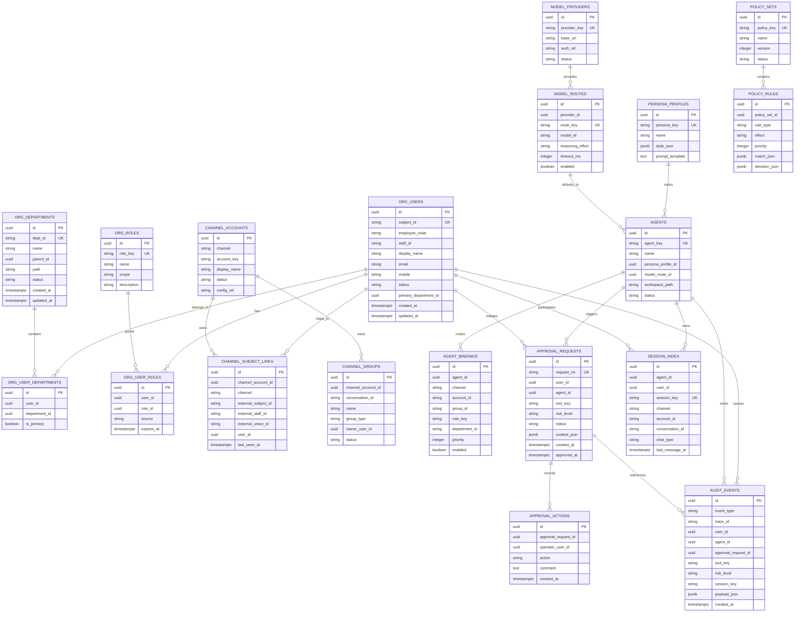

# DingClaw 数据库 ERD 草案

## 说明

本草案用于指导首期 PostgreSQL 表设计。  
重点放在：

- 身份
- 组织
- 策略
- agent
- 审批
- 审计

## ER 图

## 建表优先级

### P0 必须先建

- `org_users`
- `org_departments`
- `org_roles`
- `org_user_roles`
- `channel_accounts`
- `channel_subject_links`
- `agents`
- `agent_bindings`
- `policy_sets`
- `policy_rules`
- `approval_requests`
- `approval_actions`
- `audit_events`

### P1 第二批

- `channel_groups`
- `persona_profiles`
- `model_providers`
- `model_routes`
- `session_index`

### P2 后续增强

- 成本统计表
- 浏览器证据表
- 工具运行明细表
- 卡片交互明细表

## 索引建议

### `org_users`

- `subject_id`
- `staff_id`
- `employee_code`
- `primary_department_id`

### `channel_subject_links`

- `(channel, external_staff_id)`
- `(channel, external_subject_id)`
- `user_id`

### `agent_bindings`

- `(channel, priority desc)`
- `(agent_id, enabled)`

### `policy_rules`

- `(policy_set_id, priority desc)`
- `rule_type`

### `approval_requests`

- `request_no`
- `status`
- `user_id`
- `created_at desc`

### `audit_events`

- `trace_id`
- `event_type`
- `user_id`
- `agent_id`
- `created_at desc`

## 命名建议

- 业务主键统一 `uuid`
- 外部平台 id 不当主键
- 所有时间使用 `timestamptz`
- JSON 扩展字段统一 `jsonb`

## 约束建议

- `subject_id` 唯一
- `request_no` 唯一
- `agent_key` 唯一
- `role_key` 唯一
- `policy_key + version` 唯一
- `session_key` 唯一

## 首期落地建议

首期不要试图把所有 OpenClaw 原生 session 数据完全迁进数据库。

建议：

- OpenClaw 原生 session 仍保留文件存储
- DingClaw 先维护 `session_index`
- 业务审计、审批、身份、策略全部进 PostgreSQL

这样改造风险最低。
